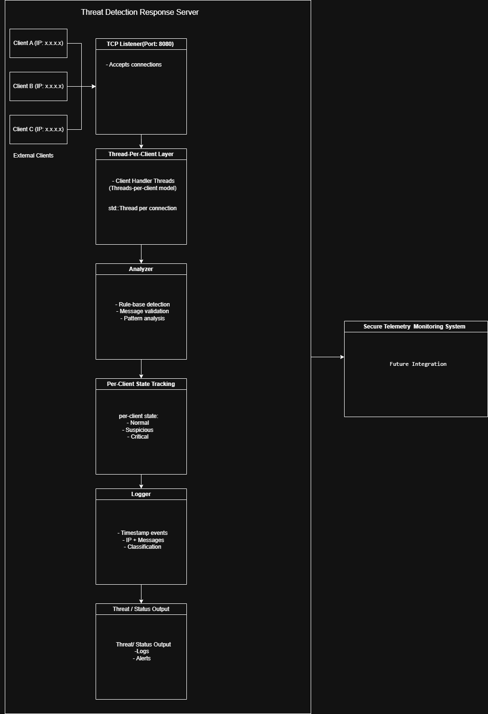

# Threat Detection & Response Server

A modular multi-client backend server built in C++ for Linux environments, designed to receive client activity, detect suspicious behavior, classify threat levels, log security-relevant events, and support automated response workflows.

This project is the first major component of a larger Threat Detection & Response System that may later include lightweight client agents, a mission-control style dashboard, persistent storage, and deeper integration with secure telemetry infrastructure.

---

## Overview

Modern monitored systems—especially those involving **uncrewed platforms, distributed devices**, or Linux-based infrastructure—require continuous visibility into client activity, message behavior, and connection patterns.

This server acts as the **core detection and response layer**. It is responsible for:

- accepting connections from multiple clients
- processing client messages concurrently using a thread-per-client model
- parsing and validating incoming messages
- applying rule-based threat detection
- maintaining per-client threat state
- logging events, classifications, and response decisions
- triggering response actions based on severity

---

## Project Vision

The long-term vision is to build a small but realistic security monitoring system with three major parts:

1. **Client Agents** — lightweight programs that report activity from monitored machines
2. **Threat Detection Server** — the C++ backend that receives events, analyzes behavior, classifies threats, and triggers responses
3. **Mission Control Dashboard** — a live interface for viewing connected clients, alerts, logs, and threat state

The current repository begins with the Threat Detection Server, keeping the first implementation focused on backend networking, detection logic, client state tracking, and structured logging.

---

## Security Philosophy

This project approaches security from a **monitoring, detection, and response** perspective.
Rather than treating security as only encryption or authentication, the system focuses on:

- visibility into client and system behavior
- detection of abnormal or suspicious patterns
- classification of operational risk
- traceable logging of decisions and evidence
- controlled response actions based on severity

Secure communication, authentication, and stronger client identity validation are planned future improvements. The first goal is to build a clean detection and response foundation.

---

## Core Concepts

### Threat Detection
The server evaluates incoming messages using rule-based logic to identify suspicious or abnormal behavior.

Example rule categories include:

- repeated failed authentication attempts
- malformed messages
- unauthorized commands
- suspicious request frequency
- replayed request IDs
- invalid or expired session tokens
- repeated connection attempts from the same client
- unexpected message structure or invalid fields

---

### Per-Client State Classification

Each connected client maintains its own threat state:

- NORMAL
- SUSPICIOUS
- CRITICAL

State transitions are driven by message content, client behavior, connection patterns, and historical activity.

---

##Response Actions

Response refers to backend-driven actions based on threat severity.

Possible responses include:

- logging the event
- raising an alert
- marking a client/session as suspicious
- rejecting a request
- temporarily blocking a client
- increasing monitoring level for a client
- storing evidence in structured logs
  
---
## Example Message Format

The server is planned to support structured messages. Initial versions may use newline-delimited JSON or structured plain text.

Example JSON message:
```bash
{
  "client_id": "sensor_01",
  "timestamp": "2026-04-23T18:30:00Z",
  "event_type": "AUTH_ATTEMPT",
  "status": "FAILED",
  "request_id": "abc123"
}
```

---
## Detection Scope

The system is designed to detect and respond to:

- malformed or invalid messages
- repeated error conditions
- repeated failed authentication attempts
- suspicious command patterns
- suspicious request frequency
- abnormal message frequency
- replayed request identifiers
- invalid or expired session tokens
- repeated connection attempts from the same client
- unusual client connection behavior
- suspicious IP-based activity patterns
- unauthorized or unknown client activity
- communication loss, such as missing heartbeats
- telemetry inconsistencies
- rule violations in expected message flow

---

##Project Structure

Initial server-focused structure:
```bash
threat-detection-server/
│
├── src/
│   ├── main.cpp
│   ├── server.cpp
│   ├── server.h
│   ├── parser.cpp
│   ├── parser.h
│   ├── threat_engine.cpp
│   ├── threat_engine.h
│   ├── response_engine.cpp
│   ├── response_engine.h
│   ├── client_state.cpp
│   ├── client_state.h
│   ├── logger.cpp
│   └── logger.h
│
├── logs/
│   └── threat_log.txt
│
├── docs/
│   └── architecture.md
│
├── tests/
│
├── Makefile
└── README.md
```
Long-term system structure may expand to include:

```bash
threat-detection-system/
│
├── server/      # C++ threat detection server
├── agent/       # future lightweight client agent
├── dashboard/   # future monitoring interface
├── docs/        # architecture notes, diagrams, threat rules
├── tests/       # test clients and detection tests
└── README.md
```

---

## Architecture
Current server architecture:


```bash
Multiple Clients
        ↓
TCP Listener (Server)
        ↓
Client Handler Threads
        ↓
Message Parser
        ↓
Threat Engine
        ↓
Client State Tracker
        ↓
Response Engine
        ↓
Logger
        ↓
Threat / Status Output
```
---

## Components

#### Server

- initializes TCP listener
- accepts multiple client connections
- spawns a thread per client
= receives incoming messages
- forwards client/message data into the processing pipeline

#### Threat Engine
- applies rule-based detection logic
- assigns threat level
- evaluates message content, client behavior, and recent activity

#### Client State Tracker
- tracks per-client history
- stores recent events, failed attempts, suspicious behavior, and connection metadata
- supports client-specific threat classification

#### Response Engine
- decides what action to take based on threat level
- supports actions such as log, alert, reject, block, or increase monitoring level

#### Logger
- records timestamped events
- stores client identity, IP/connection metadata, message content, classification, and response decision

#### Main
- orchestrates system flow
- initializes components
- manages lifecycle

---
<!-- 
//## Architecture Diagram



The diagram will illustrate:

multiple external clients
TCP listener and connection handling
thread-per-client execution model
message parsing pipeline
threat engine
per-client state tracking
response engine
structured logging flow
future client agent, dashboard, and telemetry integration points

-->

## Use Cases

This system can conceptually apply to:

- monitoring client activity across Linux-based systems
- detecting suspicious command or authentication patterns
- analyzing event streams from distributed devices
- monitoring uncrewed vehicle telemetry channels
- supporting security monitoring pipelines
- acting as an analysis layer in a larger control or telemetry system

---
<!--
Development Roadmap
Phase 0: Setup & Foundation
set up Linux development environment
initialize Git repository
define project structure
create initial README and documentation notes
prepare Makefile/build workflow
Phase 1: Core Server
build a concurrent TCP server in C++
accept multiple client connections
implement thread-per-client handling
receive structured messages
parse and validate basic input
log received events
classify simple events as NORMAL or SUSPICIOUS
Phase 2: Threat Detection & Response
add multiple detection rules
implement client/session state tracking
support threat levels: NORMAL, SUSPICIOUS, and CRITICAL
add automated response decisions such as log, alert, reject, or block
improve structured logs and evidence trail
create repeatable test scenarios
Phase 3: Hardening & Polish
improve error handling
refine architecture and module boundaries
add scripted test clients
add sample logs and detection examples
document threat rules and response behavior
finalize architecture diagram
Phase 4: Persistence & Operations
add database-backed event storage, such as PostgreSQL
add log rotation or archival strategy
explore syslog or systemd integration
add queryable event history
Phase 5: Secure Communication & Client Identity
add encrypted message transport
add message integrity validation
add client authentication and identity validation
improve session handling and replay protection
Phase 6: System Expansion
develop lightweight client agents
add heartbeat monitoring from agents
add dashboard or terminal monitoring interface
integrate with secure telemetry systems
expand automated response workflows
---
-->


## Relationship to Other Systems

This project is designed to remain standalone during early development, while leaving room for future integration with a previously developed project:

**Secure Communication and Monitoring System**

That system focuses on secure telemetry transmission, encryption, PostgreSQL logging, and hardware-level monitoring on Raspberry Pi.

The **Threat Detection & Response Server** is intended to become a backend intelligence layer that can analyze incoming events and determine system risk levels before passing results to logging, alerting, dashboard, or telemetry components.

---

## Build and Run

Instructions will be added as implementation progresses.

Planned usage:

```bash
make
./threat_server
```
Testing example:
```bash 
nc localhost 8080
```

---

## Status
Currently in early development.

## Author

Oscar Campos
